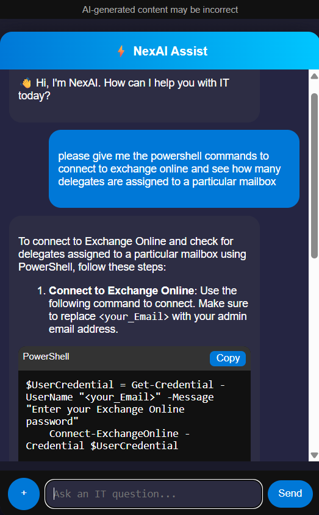
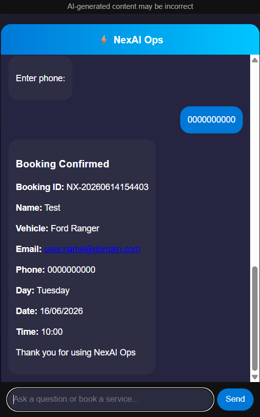

# ⚡ NexAI – Modular AI-Powered Execution Platform
 

 
https://img.shields.io/badge/Status-Active--Development-orange
 
---
 
NexAI is a modular AI-powered platform designed to combine **conversational intelligence** with **real-world task execution**.
 
The platform separates **AI reasoning** from **operational workflows**, enabling scalable, domain-specific modules that integrate with enterprise systems.

## 📸 Demo
 
<table>
<tr>
<td width="50%">
 
<h3>🔎 Assist Module (Enterprise IT Support)</h3>

This example demonstrates NexAI Assist providing support for Azure Active Directory scenarios.

 

 
</td>
 
<td width="50%">
 
<h3>⚙️ Ops Module (Workflow Execution)</h3>

This demonstrates NexAI Ops executing a complete service booking workflow.

 

 
</td>
</tr>
</table>
 
---
 
## 🚀 Key Capabilities
 
✅ Conversational AI powered by HuggingFace DialoGPT 
✅ Intent detection for structured workflows (booking, rescheduling, support) 
✅ RESTful API architecture using Flask 
✅ Dynamic recommendation engine based on user data 
✅ Persistent interaction logging for contextual memory 
✅ Secure configuration using environment variables (`.env`) 
 
---
 
## 🏗️ System Architecture
 
The system is designed using a modular backend architecture:

Each component is loosely coupled to allow future migration into microservices.
 
---
 
## 🔌 API Endpoints
 
### 🟢 `/chat`

Handles conversational interaction  

- Input: user message + session ID  

- Output: AI-generated response  
 
---
 
### 🟢 `/recommend`

Generates personalized recommendations  

- Input: user ID  

- Output: suggested items/services  
 
---
 
### 🟢 `/health`

Service health check endpoint  
 
---
 
## 🗄️ Data & Persistence
 
- SQLAlchemy ORM used for database abstraction  

- Interaction logging enables conversation tracking  

- Designed to support session-based context handling  

- Compatible with PostgreSQL and SQLite  
 
---
 
## 🧩 Core Components
 
| Component        | Responsibility |
|-----------------|--------------|
| **NLP Engine**   | Processes user input and generates responses |
| **API Layer**    | Handles HTTP requests and responses |
| **Recommender**  | Produces data-driven suggestions |
| **ORM Models**   | Manages database interaction |
| **Logging Layer**| Tracks conversational sessions |
 
---
 
## 🛠️ Tech Stack
 
**Backend:** Python, Flask  

**AI/NLP:** HuggingFace Transformers (DialoGPT)  

**Database:** PostgreSQL / SQLite  

**ORM:** SQLAlchemy  

**Environment Management:** python-dotenv  

**Communication:** REST APIs  
 
---
 
## 🔐 Security & Best Practices
 
- Sensitive data stored in `.env` (not committed to GitHub)  

- No hardcoded credentials in code  

- Clean separation of concerns across components  

- Structured for scalability and maintainability  
 
---
 
## ⚙️ Local Setup
 
1. Clone the repository  

2. Create a `.env` file:
 
3. Install dependencies:

4. Run the application:
 
---
 
## 🎯 Use Cases
 
- Customer service automation  

- Intelligent booking systems  

- Enterprise AI assistants  

- Backend-integrated chatbots  

- Recommendation-driven platforms  
 
---
 
## 📌 Status
 
✅ Fully functional modular AI platform 
🚧 Continuous refinement towards enterprise-scale readiness

---
 
## 💡 Vision
 
NexAI is designed as a:
 
> **Modular AI-powered execution platform**
 
capable of integrating intelligent decision-making directly into operational workflows across multiple domains.
 
The goal is to enable AI systems that not only provide insight, but actively participate in and automate real-world processes. 

---
 
## 👨‍💻 Author
 
**Paul Munhamo**  

BSc Honours IT - Software Engineer
 